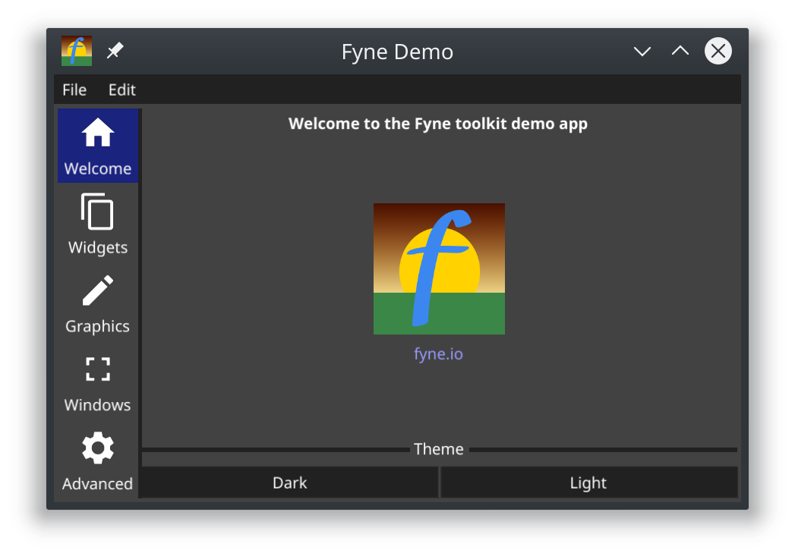
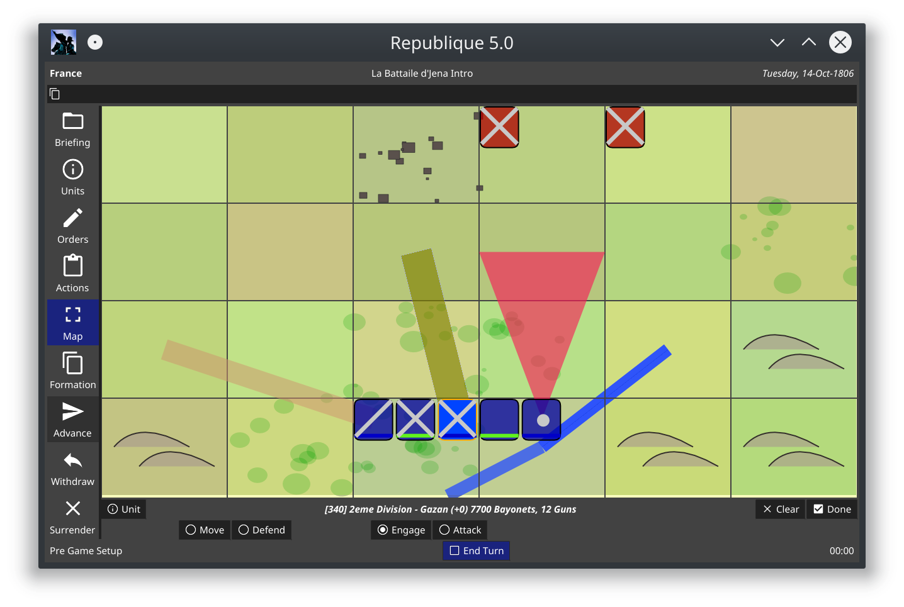

# Intro 

- About me.  App developer since the early 80s. Full time Gopher for the last 5-6 years.
- Fyne team - (More details needed here), but basically, we have a great dev team with a string of 
stunning acheivements in the GUI framework space.
- I picked up Fyne late in 2018, whilst looking for a GUI lib to base my latest game development on.
- Officially contributor #2 in the fyne team :) 
- I worked on the deeper internals of the fyne toolkit, including the channel based event management, 
quite a bit of work on race condition management and locking.
- These days I am mostly focused on app development again, using the Fyne toolkit and developing
custom widgets.

# The Promise of Native Applications

Fun + No Constraints + Highest Performance = Creativity 

- Native App development is FUN.
- Native Apps give the developer full access to the OS and the underlying machine.
- Native Apps give the developer the best opportunity for getting the highest performance
out of a machine.
- Native Apps give the developer a blank canvas to write on, with the bare minimum 
of design constraints.
- Going Native means that _if you can imagine it, you can code it._

# The Problem

- Developing standalone, native GUI apps is HARD.
- Cross platform native GUI app development is even HARDER.
- Managing Distribution, Assets, Updates and Dependencies for native apps can be painful.
- Developing GUI apps in Go means dealing with external libs that are not written in Go.

# But ... WebApps ?

- WebApps have made development and distribution of code much simpler.
- Web Development / HTML / CSS / Javascript itself ... 
has introduced a whole new set of challenges for the developer.
- Using Go (GopherJS or WebASM) to write WebAPP front ends is very useable, but not a mainstream option.
- Interfacing your Go web front end code with readily available JS libraries is very painful. 
- Resource consumption, design constraints, and portability outside of the browser are never
going to be as good as native for the forseeable future.

# The Native Solutions for GO

- There is a huge wealth of mature GUI toolkits available (Qt / GTK / SDL / etc)
- Pretty much all GUI tools exist as C libraries to link your application against. 
- As a Go app developer, you really want to trace your code execution from your
app, all the way through the GUI lib, and back into your app, examining variable content
all the way.
- Go apps built with CGO / external C code ... not so accessible, and very hard 
to debug / trace.

# Enter Fyne

- Lets build a new GUI toolkit from scratch !
- Lets build it entirely in Go, with no dependencies !
- Yes, every little mouse move, every layout width calculation,
every keystroke processing,
screen scaling,  window shadowing, scrollbar rendering, 
button highlighting function - to be written in 100% easy to read Go code.

# ... What, Really ?
  
- Lets use material design as the definitive model for design decisions.
- Lets use Go's excellent test tools to engineer this with thorough test coverage from day 1.
- Lets include asset bundling and cross compilation into the tools.
- Lets use well known and battle tested concepts for layout management and widget design.
- Lets design the API "mobile first", with provided desktop extensions.
- (ie - dont just assume that all users have a keyboard and mouse)

# ... But what about .. ?

- Lets express the hardware level graphics driver as a simple Go interface.
- Lets use floating point scaling for all internal coordinate systems.
- Lets exploit Go's concurrency model, goroutines and channels to do all the tricky internals,
thread coordination and event processing inside the toolkit.
- Lets build a driver for OpenGL / GLES from day 1.
- Lets aim to have plug in drivers for WebASM and Mobile, so that your same
Go / Fyne app code will run inside the browser, and as both iOS and Android native

# One Year Later ...

http://fyne.io

If you are using Windows, macOS or Linux and already have Go installed then the following command will do everything to get Fyne installed:

```
$ go get fyne.io/fyne
```

Once that command completes you will have the full Fyne development package installed in your GOPATH.

If you want to see the Fyne toolkit in action before you start to code then you can see our demo app running on your computer by executing:

``` 
$ go get fyne.io/fyne/cmd/fyne_demo
$ fyne_demo
```

And that’s all there is to it. Let’s look more at how to use the Fyne APIs to create your own cross-platform graphical application.

# Hello World

```
package main

import (
	"fyne.io/fyne/app"
	"fyne.io/fyne/widget"
)

func main() {
	a := app.New()

	w := a.NewWindow("Hello")
	w.SetContent(widget.NewVBox(
		widget.NewLabel("Hello Fyne!"),
		widget.NewButton("Quit", func() {
			a.Quit()
		}),
	))

	w.ShowAndRun()
}
```


# Fyne Demo

... spend a few minutes running the bundled `fyne_demo` app, which is a typical kitchen-sink 
widget demo that most toolkits provide as part of the documentation.

Depending on audience reaction / questions ... jump to the Widget code for one or two examples
so as to demonstrate clearly how a few lines of code affect the app on the screen.



# Fyne Examples

... spend a minute or 2 running the Fyne Examples app, which has some more detailed examples
and uses a variety of patterns to construct applications.

https://github.com/fyne-io/examples

.. cut to a session of playing Solitaire, or exploring some fractals all written using 
Fyne.

.. really quick dive / display of the code in examples, where to find it, and 
encourage people to have a play with the code in there to learn the examples.


# Fyne Widgets using 3rd Party Libs

- Fyne widgets can be built to wrap existing Go libraries that manipulate standard Go
`image.RGBA` content.

Demostration of using third part Go libraries integrated into your application widgets :
- https://github.com/llgcode/draw2d 2D Drawing primitives.
- https://github.com/peterhellberg/karta Voronoi diagrams for game world generation.
- https://github.com/vdobler/chart  For building barchart and businessy type widgets


# Games / Creativity Demo

I wrote this one here in a weekend, mainly to work on optimising the raster image processing
in fyne, but it turned out to be a bit of a fun project.

Whilst browsing through github looking for some code, I stumbled upon this excellent BASIC 
interpreter written in Go ... so one thing quickly led to another, and both Andy and I independently
went off and wrote a machine emulator using Fyne.

Here is my weekend hack project with that - 

https://github.com/potato-arcade/p64

Which runs a simple virtual computer with memory mapped graphics output, and allows you to
load up "BASIC ROM Cartridges" written in a dialect of BASIC called PotatoBASIC that
does interrupt based goroutines.

Here is a demo of my virtual Go machine running classic PONG written in "PotatoBASIC"

... all made easily possible thanks to Fyne.


```
.INTR VSYNC
CLEAR
LET X = PEEK 1
LET Y = PEEK 2
LET DX = PEEK 3
LET DY = PEEK 4
X = X + DX
Y = Y + DY
PRINT

100 GOSUB 1000
110 GOTO 2000

1000 IF X > 0 THEN RETURN
1010 X = 1
1020 DX = 1
1030 RETURN

2000 SET X,Y,1
2010 POKE 1, X
2020 POKE 2, Y
2030 POKE 3, DX
2040 POKE 4, DY
END
```

# A Larger Example

.. time permitting, fire up my multiplayer turn based game, that happens to use a lot
of Fyne widget elements.  

Not a code dive, but an example of a large and complex app.



# Wrapping it Up

Resources 

http://fyne.io
http://tour.fyne.io

The Book - written by Andy


https://www.amazon.com.au/Hands-GUI-Application-Development-cross-platform-ebook/dp/B07GYLYSCT

Fyne Channel on gophers slack

Fyne Contributors channel on gophers slack

How to contribute:
- Asset creation
- App developers
- Hardcore driver development
- Documentation writing

# Q&A if time permits ..


